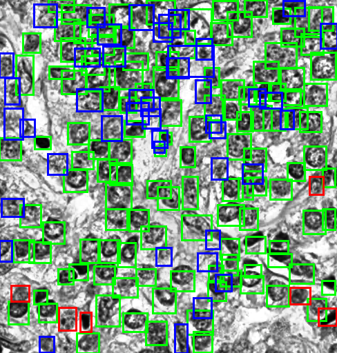
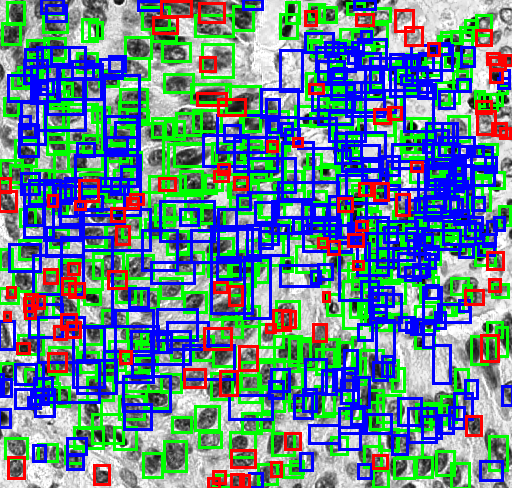

# CNNCellDetection
This repository contains adaptations of the state-of-the-art deep learning based object detection models for the detection of cell nuclei in histology images


First you have to clone the Luminoth repo either from its official repo or the forked repo, which has some modifications made internally.

1. Official repo: https://github.com/tryolabs/luminoth.git
2. Forked Modified repo: https://github.com/cramraj8/luminoth.git

Forked repo has,

* ResNet block 3 **num_units** hyper-parameter exposed in base_config.yml for all ResNet variants
* provided ```img = input_img[:, :, :num_channels]``` in dataset loading function
 to facilitate gray image loading and unncessary TensorFlow reshaping exceptions.
* provided end-points in feature extraction from R-CNN layers


# Data Generation


Raw data can be found in different formats. Either in csv file or **PascalVoc** format in order to train the model.
You can check the documentation for more info at https://luminoth.readthedocs.io/en/latest/usage/dataset.html

1. csv file only needs to contain the following columns, and the columns names can be overidden by input argument.
```
    a. image_id
    b. bounding box coordinates in either convention
            - x_min, y_min, x_max, y_max
            - x_center, y_center, width, height
    c. class label(for class-agnostic model, represent by objectness class)
```

2. PascalVoc data folder should look like below,


```
   Data
    ├── annotations                     - Folder contains XML ground truth annotations.
    │
    │
    ├── ImageSets
    │   └──Main
    │       ├── objectness_train.txt    - contains the image_ids that has this particular 'objectness' class.
    │       └── train.py                - contains the image_ids that is going to be used for training.
    │
    │
    └── JPEGImages                      - Folder contains JPEG/PNG images.
```


## To create tfrecord data

Either place **image**, **annotations**, **train.txt** in appropriate arrangements inside the '**pascalvoc_format_data**' folder or
have a csv file in appropriate format.


## Luminoth CLI:

from PascalVoc format to tfrecord generation
```
    $ lumi dataset transform \
        --type pascal \
        --data-dir ./data/pascalvoc_format_data \
        --output-dir ./data/tf_dataset \
        --split train
```


from csv format to tfrecord generation
```
    $ lumi dataset transform \
        --type csv \
        --data-dir ./data/csv_file \
        --output-dir ./data/tf_dataset \
        --split train
```


you may want to execute this command by standing inside **luminoth/** folder.


# Training
```
$ lumi train -c train/config_resnet101_ff12ep4_default.yml
```

To monitor the real-time performance of the training model, we can enable tensorboard.
```
$ tensorboard --logdir=<path_to_dir_jobs/my-run/>
```

If you want to modify the parameters of the model or training, you can do in the config file. There is a config file(**base_config.yml**) inside the path
'**luminoth/models/fasterrcnn/**'. Also there is another very short config file(**sample_config.yml**) inside the path '**examples/**'. Therefore, you can copy the entire
base_config.yml, make changes to it, and provide its path with **-c** flag in the CLI so that the parameters will be overidden while initiating the training.


# Prediction
```
$ lumi predict -c train/config_resnet101_ff12ep4_default.yml --min-prob 0.1 --max-detections 800 -d <output_dir_path>
```
This CLI command is to generate prediction overlays visually in .png file and prediction coordinates together with labels in .json file.
The only safely tunable parameters at inference stage are min-prob and max-detections, which are used in filtering out the final predictions.

**Remember**: When you are increasing the max-detections, the R-CNN part of the network will throw out more detection proposals that consumes more GPU memory. It
can result in memory overflow exception.


# Evaluation

Two methods of evaluation conducted,

1. IoU based mAP evaluation method
2. Objectness/classification confidence score based AUC evaluation method
        using Hungarian Algorithm for mapping GT with Predictions

Generally, in the PascalVOC and COCO object detection challenges people often use method #1; however, this method
is better fit for the problem of detecting small number of objects per image. But in the nuclei-detection problem domain,
we usually face more than 100 nuclei(objects) in each image. In this case, without mapping best prediction bndbox with ground-truth,
it is hard to identify the redundant detection bndboxes based on method #1.

The example of evaluation results overlayed over the input image using method #2 because of the main reason - crowded bndbox detections.
Green boxes are TPs, blue boxes are FP, and red boxes are FNs respectively.

<!--  -->
<!--  -->

<!-- {:height="45%" width="44%"}
{:height="45%" width="49%"} -->

<!--   -->

Evaluation overlays of prediction example-1                |  Evaluation overlays of prediction example-2
:-------------------------:|:-------------------------:
  |  


# Nuclei Detection Web CLI Plugin

An extended plugin for [girder/slicer_cli_web](https://github.com/girder/slicer_cli_web)

The complete workflow of the Dask-TensorFlow enabled pipeline is below ...


To build a Docker Image from this CLI Plugin,

First pull Nuclei-Detection TensorFlow pre-trained model files and place them inside the 'cli/jobs/' folder because these files
are going to be placed inside the Docker Image. Or place a `wget <link_for_pretrained_file>` line in Dockerfile after line #13.


then run,

```
$ docker build -t <DockerImage_name>:<DockerImage_tag_version> <Dockerfile_path>
```

To check the Docker Image is completely running,

1. First create a Docker Container of this Docker Image and navigate into /bin/bash
```
$ docker run -ti -v <local_volume_folder>:<Docker_volume_folder> --rm --entrypoint=/bin/bash <DockerImage_name>:<DockerImage_tag_version>
```
  Note : -v : used for mouting local and Docker folders so that the changes to the folder will be mirrored immediately.

2. Your default working directory inside the Container bash is '/Applications/', so run a sample test run.
```
$ python FasterNuclieDetection/FasterNuclieDetection.py ../91316_leica_at2_40x.svs.38552.50251.624.488.jpg annot.anot timeprofile.csv
```
3. Check the annotation and timeprofile files in the local folder.


# Dask Execution

The Dask-CPU enabled CLI application folder is **cli/FasterNuclieDetectionCPU/**. The script consists complete pipeline. If we run this cli on a local
machine, then Dask will create default number of workers for action run.


If we want to run this pipeline on **cluster** environment, first we need to intialize **Dask-scheduler** and then run the script. Dask-scheduler will connect, split, configure the workers
to run the tasks in parallel.

```
$ dask-ssh --hostfile=nodenames.txt  --remote-python=<virtualenv_path_python_folder> --remote-dask-worker=distributed.cli.dask_worker --nprocs=6
```

**nodenames.txt** is just a text file contains the node names at its each line. **virtualenv_path_python_folder** is usually be `~/.virtualenvs/<virtualenv_name>/bin/python`. **nprocs** flag is
used to specify the number of processes that we want to run on each node.

Once we run the above CLI, the Dask-scheduler will be created in a virtual terminal session. Now you can run your script in another terminal session.

**Note** : Any paths that you define inside the script should be declared in a file so that the all the nodes connected with the head node knows where to look for.
For this purpose, we usually create a `<sample_filename>.pth` inside **site-packages** folder(usally located at `~/.local/lib/python2.7/site-packages/`), and write down the
paths at each line. The paths that we usally consider are,

1. any libraries that we installed outside the site-packages.
2. any 'import file' location(like utils.py).
3. input file location.
4. ouput dir location.
5. ckpt(pretrained files) dir location.
6. sample_config.yml file location.

Now when we run the CLI
```
$ python FasterNuclieDetectionCPU/FasterNuclieDetectionCPU.py ../91316_leica_at2_40x.svs.38552.50251.624.488.jpg annot.anot timeprofile.csv
```
the task will be running in multi-worker nodes parallelly.

You can monitor the real time Dask performance using **Bokeh** tool. If you already installed this library in the virtualenv, the `port: 8787` will be listenining always to
Bokeh.
